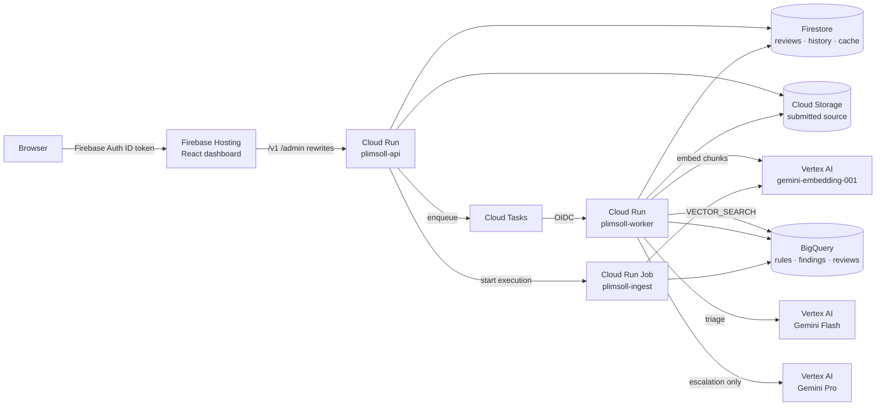

# Plimsoll

**An always-on code reviewer with a deterministic quality score.**

Plimsoll reviews source code in 15 languages and reports bugs, security issues, architectural
problems and optimisation opportunities, then rates the file on a **1–10 scale that the language
model never produces**. The model only classifies findings. A versioned rubric turns those findings
into the score, so the same findings always give the same number and every lost point traces back to
a specific finding.

> The Plimsoll line is the mark on a ship's hull that shows whether it is safe to sail — a computed
> threshold anyone on the dock can check, not someone's opinion. That is what the scoring engine is.

**Measured on the deployed system** (Vertex AI list prices, September 2026):

- **44% cheaper per review** than sending everything to the expensive model — **61%** on real-world
  code — in a paired benchmark of 16 files reviewed both ways.
- **Identical resubmissions cost $0** and return the same score in under a second.
- **30,000 historical rules ingested in 3 min 33 s for $0.10**; re-ingesting the same file costs nothing.

## What it does

- **Review** a file (paste or upload): findings with severity, dimension, line range, a suggested fix,
  and the historical rules that informed each finding.
- **Score** 1–10 with per-dimension subscores and an exact breakdown: *"you lost 3.7 points because of
  this finding"*. Deductions always add up to the total.
- **Learn from historical review data**: ingest a CSV of `id, type, description` rules (3 or 30,000
  rows, messy or clean). Rules are embedded and retrieved per code chunk to ground the review.
- **Track growth**: every review is stored per user; resubmissions of the same file form a history, so
  improvement on the same code is visible over time.
- **Spot recurring issues**: findings by dimension and severity, and the rules triggered most often.
- **Account for cost**: every model call records tokens and dollars; a dashboard shows cost per
  review, cache hit rate, escalation rate, cost per 1,000 reviews, and a measured comparison with an
  all-expensive-model baseline.

## How the score stays deterministic

```
points(finding) = severity_points[severity] × dimension_weight[dimension]   (0 if confidence < 0.3)
R               = Σ points
score           = 1 + 9 · e^(−R / 8)
```

The curve keeps every score inside [1, 10] without clipping and strictly decreases as findings are
added. Weights live in [`rubric/v1.yaml`](rubric/v1.yaml); the rubric version is stamped on every
review. Property tests (Hypothesis) enforce the guarantees: identical findings give identical scores
in any order, adding a finding never raises the score, the result is always within [1, 10], and the
per-finding deductions add up exactly to the total.

The model's *findings* can vary between runs, as with any LLM. Identical submissions are served from a
content-hash cache, so a user who resubmits unchanged code gets the identical result, instantly, at
zero cost.

## Architecture



**Review path.** `POST /v1/reviews` validates size, UTF-8 and language before any token is spent,
computes the cache key (content, language, rubric version, prompt version, both model IDs, rules
corpus version, tenant) and returns the cached result if there is one. Otherwise it stores the source,
enqueues a Cloud Task and returns **202**. The worker splits the file into functions with tree-sitter,
retrieves the nearest historical rules for every chunk in one BigQuery vector search, asks Gemini
Flash for findings (structured output, temperature 0), and escalates to Gemini Pro only when a
finding is high or critical, confidence is low on a medium-or-worse finding, or the output could not be
parsed. It validates the findings (line ranges, only rule IDs that were actually offered), scores
them, stores the result and cache entry, and writes analytics rows.

**Rules path.** `POST /admin/rules:ingest` stores the CSV and starts a Cloud Run Job execution. The job
parses tolerantly (quoted commas, em-dashes, non-ASCII, blank lines, duplicate IDs, unknown types,
legacy encodings), embeds only new or changed rules, merges them into BigQuery every 2,000 rows and
publishes a new corpus version, which invalidates the review cache. Re-ingesting the same file costs
nothing; a failed run resumes from its last checkpoint.

See [`docs/GCP_SERVICES.md`](docs/GCP_SERVICES.md) for every service and resource, and
[`DECISIONS.md`](DECISIONS.md) for the reasoning — including the problems found while measuring.

## Cost

### Two-tier triage vs an all-Pro baseline (paired benchmark)

Sixteen files — 10 real-world source files (Python, TypeScript, JavaScript, TSX) and 6 deliberately
flawed demo files (Python, TypeScript, Go, Java) — each reviewed twice with no cache: once through the
two-tier pipeline, once with every call sent to Gemini Pro. Run `plimsoll benchmark <files>` to
reproduce; the dashboard's Cost tab shows the latest run.

| Set | Files | Escalated | Two-tier / review | All-Pro / review | Two-tier saves |
|---|---:|---:|---:|---:|---:|
| **All files** | 16 | 56% | **$0.0206** | $0.0372 | **45%** |
| Real-world code | 10 | 30% | $0.0177 | $0.0456 | 61% |
| Deliberately flawed demo code | 6 | 100% | $0.0255 | $0.0233 | −10% |

Where the savings come from:

| | Two-tier | All-Pro |
|---|---:|---:|
| File with no serious findings (Flash only) | **$0.0049** | $0.0500 |
| File that escalates (Flash, then Pro) | $0.0328 | $0.0273 |

Two-tier review is cheap when most code is reasonable and slightly *more* expensive than Pro alone
when everything escalates, because escalated files pay for both models. At list price, after Flash
promotional pricing ends, the two-tier average is $0.0250 (33% below the baseline).

**Quality cost of the cheap tier:** the two pipelines gave the same score on 9 of 16 files (mean
absolute difference 0.53 points). Where they differed, the two-tier score was usually higher — the
fast model missed issues the stronger model found. See Known limitations.

### Other measured numbers

| Measurement | Result |
|---|---|
| Identical resubmission (cache hit) | $0, 0.1–0.9 s end to end |
| Rule ingestion, 30,000 rows (Cloud Run Job) | 213 s, $0.098, peak memory 727 MiB of 2 GiB |
| Query embeddings per review | ~$0.0004 |
| Review latency (median, no cache) | Flash-only ≈ 20–25 s; with escalation ≈ 45–60 s |
| Projected cost per 1,000 reviews | $37.21 all-Pro → **$16.04** with two tiers and the observed 22% cache hit rate |
| Cold start (container start to ready) | API 4.6 s, worker 5.1 s (was ~10 s before lazy client loading); set `api_min_instances = 1` to remove it during demos |

Costs are computed from the token counts Vertex AI reports, at current list prices
([`config/pricing.yaml`](config/pricing.yaml)). "List price" columns re-price the same usage after the
Gemini Flash promotional price ends on 2026-12-31.

## Data privacy

- **Submitted source code is user data.** It is stored per user (`sources/{uid}/…` in Cloud Storage and
  `users/{uid}/…` in Firestore), readable only by that user through the API, and deleted from storage
  after 30 days.
- **Source code is never logged.** Logs contain IDs, token counts, costs and error types only.
- **Source code is never used for training.** Plimsoll sends code to Vertex AI solely to generate the
  review; Google Cloud does not use Vertex AI customer data to train its models.
- The review cache is tenant-scoped by default: one user's submission never produces a cache hit for
  another user.
- Analytics tables hold metadata (scores, counts, costs, one-line finding messages) — never source.

## Getting started

### Run everything locally (no cloud account needed)

```bash
make install          # Python 3.12 virtualenv
make test             # 131 tests, offline
make run-api          # API on :8080 with in-memory storage and a deterministic fake model
make web-install && make web-dev     # dashboard on http://localhost:5173 (Node 22)
python scripts/seed.py --api http://localhost:8080 --dev-user demo:admin
```

Sign in with `demo:admin` (local dev auth). The fake model applies simple detectors so the whole
pipeline — chunking, retrieval, escalation, scoring, caching, analytics — runs without GCP.

## Deploying to Google Cloud

The whole environment is reproducible: Terraform creates the infrastructure, Cloud Build builds the
image, and a handful of one-time console steps set up sign-in. Allow about 30 minutes for a first
deployment.

### 1. Prerequisites

| Tool | Version | Check |
|---|---|---|
| Google Cloud project with billing enabled | Owner or Editor role | `gcloud projects describe <PROJECT_ID>` |
| Google Cloud CLI (`gcloud`) | recent | `gcloud version` |
| Terraform | ≥ 1.11 | `terraform version` |
| Python | 3.12 | `python3.12 --version` |
| Node.js | 22 (see `.nvmrc`) | `node --version` |
| GNU Make | any | `make --version` |

Docker is **not** required — images are built remotely by Cloud Build.

### 2. Install and authenticate

```bash
git clone <this-repo> && cd sar-plimsoll
make install            # Python virtualenv with dev tools
make web-install        # dashboard dependencies

export PROJECT=<PROJECT_ID>
gcloud auth login
gcloud config set project $PROJECT
gcloud auth application-default login                 # used by Terraform, the CLI and deploy scripts
gcloud auth application-default set-quota-project $PROJECT
```

### 3. Check model availability (optional, recommended)

Model IDs change over time. Confirm the configured models answer in your project before deploying:

```bash
TOKEN=$(gcloud auth print-access-token)
for MODEL in gemini-3.8-flash gemini-3.1-pro-preview; do
  curl -s -o /dev/null -w "$MODEL: HTTP %{http_code}\n" -X POST -H "Authorization: Bearer $TOKEN" \
    -H "Content-Type: application/json" \
    "https://aiplatform.googleapis.com/v1/projects/$PROJECT/locations/global/publishers/google/models/$MODEL:generateContent" \
    -d '{"contents":[{"role":"user","parts":[{"text":"ping"}]}]}'
done
```

Both should return `HTTP 200`. If a model is unavailable, set `triage_model` / `escalation_model` in
`infra/terraform.tfvars` to a model that is, and add its price to `config/pricing.yaml`.

### 4. Set up sign-in (one time, per project)

Firebase Authentication and Identity Platform are configured once, outside Terraform.

1. **Add Firebase to the project**
   ```bash
   gcloud services enable firebase.googleapis.com identitytoolkit.googleapis.com --project $PROJECT
   curl -s -X POST -H "Authorization: Bearer $(gcloud auth print-access-token)" \
     -H "x-goog-user-project: $PROJECT" -H "Content-Type: application/json" \
     "https://firebase.googleapis.com/v1beta1/projects/$PROJECT:addFirebase" -d '{}'
   ```
   A response containing `"name": "operations/…"` means it worked. (Alternatively: Firebase console →
   **Add project** → choose the existing Google Cloud project.)
2. **Enable Identity Platform and email/password sign-in**
   Cloud Console → search **Identity Platform** → **Enable** → **Providers** → **Add a provider** →
   **Email / Password** → enable → **Save**.
3. **Create your first user** (you will make it an admin)
   Identity Platform → **Users** → **Add user** → email and password → copy the **User UID**.
4. **Get the browser API key** that Firebase created
   ```bash
   gcloud services api-keys list --project $PROJECT --format='table(uid,displayName)'
   gcloud services api-keys get-key-string <UID_OF_"Browser key (auto created by Firebase)"> --project $PROJECT
   ```
   This key is a public client identifier (it ships to browsers), but keep it out of the repository —
   it goes in the gitignored `terraform.tfvars` below.

### 5. Configure Terraform

```bash
cp infra/terraform.tfvars.example infra/terraform.tfvars
```

Edit `infra/terraform.tfvars`:

```hcl
project_id           = "<PROJECT_ID>"
region               = "us-central1"
admin_uids           = ["<USER_UID_FROM_STEP_4.3>"]
firebase_web_api_key = "<KEY_FROM_STEP_4.4>"
# api_min_instances  = 1                        # keep the API warm for demos (billed while idle)
# billing_account    = "XXXXXX-XXXXXX-XXXXXX"   # optional budget alert, if you can manage billing
```

`terraform.tfvars` is gitignored; never commit it.

### 6. Create the infrastructure

```bash
make tf-init
make tf-plan  PROJECT=$PROJECT     # review: ~39 resources to add, 0 to destroy
make tf-apply PROJECT=$PROJECT     # type "yes"; takes 3–6 minutes
```

The first apply deploys Google's placeholder container so the services exist before any build.

| If the apply fails with | Do this |
|---|---|
| `SERVICE_DISABLED` / "API has not been used" | APIs were just enabled; wait 1–2 minutes and run `make tf-apply` again |
| An `allUsers` or domain-restricted-sharing policy error | The organisation forbids public Cloud Run services. Add `allow_public_api = false` to `terraform.tfvars` to finish the apply — but the dashboard needs a publicly invokable API (Firebase Hosting rewrites cannot send identity tokens), so ask the organisation admin for an exception for `plimsoll-api` |
| Firestore database already exists | `terraform -chdir=infra import google_firestore_database.default "projects/$PROJECT/databases/(default)"`, then apply again |
| A location constraint on Firestore | Add `firestore_location = "us-central1"` to `terraform.tfvars` |

### 7. Build and deploy the application

```bash
make deploy PROJECT=$PROJECT       # Cloud Build image → Terraform rolls API, worker and ingest job
make web-deploy PROJECT=$PROJECT   # dashboard to Firebase Hosting
```

`make deploy` builds remotely (about 2–5 minutes), then shows a Terraform plan that changes only the
Cloud Run workloads. If Cloud Build reports *permission denied*, grant its service account
`roles/artifactregistry.writer`, `roles/logging.logWriter` and `roles/storage.objectViewer`.

Shortcut for steps 6–7 on a fresh project: `make bootstrap PROJECT=$PROJECT`.

### 8. Verify the deployment

```bash
curl -s https://$PROJECT.web.app/health                 # {"status":"ok","version":"0.1.0"}
curl -s -o /dev/null -w "%{http_code}\n" "$(terraform -chdir=infra output -raw worker_url)/health"   # 403: worker is private
curl -s -H "Authorization: Bearer $(gcloud auth print-identity-token)" \
  "$(terraform -chdir=infra output -raw worker_url)/health/parsers"                                 # 15 × "ok"
```

Open `https://<PROJECT_ID>.web.app` and sign in with the user from step 4.3 — the header shows
`· admin` and a **Rules** tab.

### 9. Load historical rules

Point the local CLI at the project, then ingest a CSV (`id, type, description`):

```bash
terraform -chdir=infra output -raw local_env > .env
make rules-ingest-job CSV=demo/rules.csv     # runs the plimsoll-ingest Cloud Run Job and polls until done
```

Or upload the CSV in the dashboard's **Rules** tab. Re-ingesting the same file is free; a failed run
resumes where it stopped.

### 10. Demo data and the end-to-end check (optional)

`make seed` and `make smoke` sign in as a dedicated demo admin whose credentials live in `.env`:

```bash
DEMO_EMAIL=demo@plimsoll.test
DEMO_PASSWORD=$(python3 -c "import secrets; print(secrets.token_urlsafe(18))")
GOOGLE_CLOUD_QUOTA_PROJECT=$PROJECT .venv/bin/python -c "
import firebase_admin
from firebase_admin import auth
firebase_admin.initialize_app(options={'projectId': '$PROJECT'})
user = auth.create_user(email='$DEMO_EMAIL', password='$DEMO_PASSWORD')
auth.set_custom_user_claims(user.uid, {'admin': True})
print('created', user.uid)"
printf 'PLIMSOLL_DEMO_EMAIL=%s\nPLIMSOLL_DEMO_PASSWORD=%s\n' "$DEMO_EMAIL" "$DEMO_PASSWORD" >> .env

make seed PROJECT=$PROJECT    # demo rules + reviews showing a score improving across versions
make smoke PROJECT=$PROJECT   # health, sign-in, review, identical cached resubmission, analytics
```

### Tearing down

```bash
terraform -chdir=infra destroy -var project_id=$PROJECT
```

Stateful resources are deletable by default (`deletion_protection = false`). Set
`deletion_protection = true` in `terraform.tfvars` for an environment you want to keep. Firebase,
Identity Platform users and the browser API key are not managed by Terraform.

## Managing users and admins

Users live in **Identity Platform** (Firebase Authentication) — one list for everyone. There is no
admin table: the API decides on every request whether a user is an admin.

| Role | Can | How someone gets it |
|---|---|---|
| **User** | Review code, see their own history, insights and cost | Any signed-in account (the default) |
| **Admin** | Everything a user can, plus ingest rules (**Rules** tab) and see cost across all users | A custom claim `admin: true` on the account, **or** the account's UID in `admin_uids` |

Every user's reviews, uploaded files and analytics are isolated by their UID, whatever their role.

### Create a user

Firebase console → project → **Build → Authentication → Users → Add user** (or Cloud Console →
**Identity Platform → Users → Add user**). Enter an email and password. The new account is an
ordinary user and can sign in to the dashboard immediately.

To stop people creating accounts themselves through the public sign-up API, turn off user sign-up in
Identity Platform's settings; the dashboard itself has no sign-up screen.

### Make a user an admin

**Option A — custom claim (recommended; no redeploy)**

```bash
export PROJECT=<PROJECT_ID>
EMAIL=user@example.com
GOOGLE_CLOUD_QUOTA_PROJECT=$PROJECT .venv/bin/python -c "
import firebase_admin
from firebase_admin import auth
firebase_admin.initialize_app(options={'projectId': '$PROJECT'})
user = auth.get_user_by_email('$EMAIL')
auth.set_custom_user_claims(user.uid, {'admin': True})
print(user.email, user.uid, '->', auth.get_user(user.uid).custom_claims)"
```

Expected output ends with `-> {'admin': True}`.

**Option B — `admin_uids` (deploy-time list)**

Add the user's UID to `admin_uids` in `infra/terraform.tfvars`, then `make tf-apply PROJECT=$PROJECT`
(this redeploys the API with the new list). Useful for the first administrator of a new environment.

### Change an admin back to a normal user

- **Custom claim:** run the Option A command with `auth.set_custom_user_claims(user.uid, None)`.
  Expected output ends with `-> None`.
- **`admin_uids`:** remove the UID from the list and run `make tf-apply PROJECT=$PROJECT`.

A user listed in `admin_uids` stays an admin even without the claim, so check both.

### When changes take effect

Claims are copied into the user's sign-in token, so the user must **sign out and sign in again** (or
wait up to an hour for the token to refresh). Then:

| | Admin | User |
|---|---|---|
| Header | email · admin | email |
| **Rules** tab | shown | hidden |
| Cost tab **All users / Me** toggle | shown | hidden |
| `GET /admin/…` endpoints | allowed | `403` |

To check a user's claim without signing in as them, run the Option A command with only the `print`
line. Custom claims are not displayed in the Firebase console.

### Disable or remove a user

Firebase console → **Authentication → Users** → the user's menu → **Disable account** or **Delete
account**. Deleting a user does not delete their stored reviews (Firestore `users/{uid}/…`) or
analytics rows; uploaded source files are removed by the 30-day storage lifecycle rule.

## API

| Method & path | Purpose |
|---|---|
| `GET /health` | Liveness |
| `GET /v1/config` | Public client configuration (Firebase web config, limits, languages) |
| `GET /v1/me` | Signed-in identity and admin flag |
| `POST /v1/reviews` | Submit `{filename, content, language?}` → 202 queued, or 200 from cache |
| `GET /v1/reviews/{id}` | Review status, findings, score breakdown, cost |
| `POST /v1/reviews/{id}:retry` | Retry a failed or stalled review |
| `GET /v1/reviews` | Recent reviews |
| `GET /v1/history` | Per-file score histories and daily trend |
| `GET /v1/stats?days=` | Cost and quality statistics (`system` scope for admins) |
| `GET /v1/insights?days=` | Recurring dimensions, most-triggered rules, weekly findings per review |
| `POST /admin/rules:ingest` | Upload a rules CSV → 202 with an ingest job |
| `GET /admin/rules/ingest-jobs/{id}` | Job status, progress and report |
| `GET /admin/rules/corpus` | Current rules corpus version and size |

## Repository layout

```
rubric/v1.yaml         scoring weights (versioned)
config/pricing.yaml    Vertex AI prices used for cost accounting
src/sar_plimsoll/
  api/                 FastAPI app, auth, submission service
  worker/              Cloud Tasks target, review orchestration, ingest job entrypoint
  review/              validation, tree-sitter chunking, prompts, finding schema, cache key, triage
  scoring/             the deterministic rubric — pure functions, no I/O
  rules/               CSV parsing, ingestion (checkpointed), retrieval
  llm/                 the only place model APIs are called: retries, parsing, cost ledger
  analytics/           review/finding rows, stats, history and insights
  storage/             Firestore, Cloud Storage, BigQuery, Cloud Tasks, Cloud Run Jobs + in-memory twins
web/                   React + Vite + Tailwind dashboard
infra/                 Terraform
demo/                  demo rules and code files
scripts/               seed and smoke-test scripts
docs/                  GCP services inventory, demo script
```

## Known limitations

- **The cheap tier can miss issues.** Escalation depends on what the fast model itself flags; on some
  files it reports fewer problems than the stronger model would. The benchmark quantifies the trade.
- **Findings are model output.** Scores are deterministic given findings, but a fresh review of the same
  code can surface different findings. The cache makes repeated submissions consistent.
- **Model availability.** The escalation model is a preview model, and shared capacity occasionally
  returns 429; the pipeline retries and Cloud Tasks redelivers.

---

Created at Code Kitchen Season 01.
