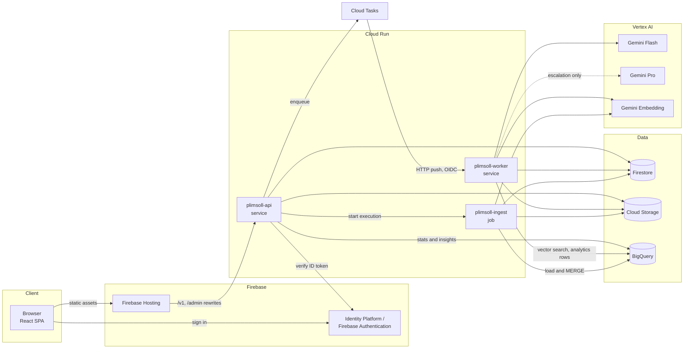

# Plimsoll — Technical Architecture

**Status:** implemented and deployed · **Version:** 1.0 · **Last updated:** 2026-09-14

This document describes how Plimsoll is built: the technology stack, the Google Cloud services and
the specific capabilities used from each, why each was chosen, and the alternatives that were
considered and rejected. It is written for engineers evaluating or extending the system.

Two kinds of evidence back the decisions, and the document keeps them apart:

- **Measured** — the alternative was tried in the deployed environment, and the numbers are quoted.
- **Design reasoning** — the alternative was rejected on documented capabilities, cost model or
  operational fit, without being built.

The running decision log with full measurements is [`DECISIONS.md`](../DECISIONS.md); the inventory
of deployed resources is [`GCP_SERVICES.md`](GCP_SERVICES.md).

---

## Contents

1. [System summary](#1-system-summary)
2. [Architecture overview](#2-architecture-overview)
3. [Application technology stack](#3-application-technology-stack)
4. [Google Cloud services](#4-google-cloud-services)
5. [Cross-cutting design](#5-cross-cutting-design)
6. [Data model](#6-data-model)
7. [Services considered and not used](#7-services-considered-and-not-used)
8. [Measured decisions](#8-measured-decisions)
9. [Measured results](#9-measured-results)
10. [Limitations and evolution](#10-limitations-and-evolution)

---

## 1. System summary

Plimsoll reviews source code and returns findings (bugs, security issues, architecture and
maintainability problems, performance issues), a **1–10 quality score**, per-user review history,
recurring-issue analytics and per-review cost accounting. Reviews are grounded in a corpus of
historical review rules ingested from CSV.

### Quality attributes that drove the architecture

| Attribute | Requirement | Primary mechanism |
|---|---|---|
| **Determinism** | The same findings always produce the same score, and every point is traceable | The model never scores; a pure, property-tested rubric does |
| **Cost efficiency** | Low cost per review and a credible cost-to-scale story | Content-hash cache, two-tier model triage, batched calls, per-call cost ledger |
| **Robustness** | Unseen, large, messy CSVs must ingest end to end | Tolerant parser, checkpointed and resumable ingestion in a batch job |
| **Responsiveness** | Submissions must not block on model latency | Asynchronous processing behind a task queue |
| **Tenant isolation** | Submitted code is private user data | Per-user storage paths and records, tenant-scoped cache, no source in logs |
| **Reproducibility** | The environment must be rebuildable from zero | Terraform for all infrastructure; one-command bootstrap |
| **Platform constraint** | Google Cloud services only | Every managed dependency is a Google Cloud or Firebase service |

---

## 2. Architecture overview

### 2.1 Context and containers



### 2.2 Deployment view

One container image, built once, runs as three Cloud Run workloads that differ only in start
command and resources.

| Workload | Type | Start command | CPU / memory | Timeout | Concurrency | Scaling | Ingress / invoker |
|---|---|---|---|---|---|---|---|
| `plimsoll-api` | Service | `uvicorn sar_plimsoll.api.app:app` | 1 vCPU / 512 MiB | 300 s | 40 | 0–3 (min configurable) | Public; auth enforced in app |
| `plimsoll-worker` | Service | `uvicorn sar_plimsoll.worker.app:app` | 1 vCPU / 1 GiB | 900 s | 4 | 0–3 | IAM: only the tasks service account |
| `plimsoll-ingest` | Job | `python -m sar_plimsoll.worker.ingest_job` | 2 vCPU / 2 GiB | 3,600 s per task | 1 task | per execution | IAM: API may execute with overrides |

Both services use request-based CPU billing, startup CPU boost and a 1-second startup probe; the job
is billed only while an execution runs.

### 2.3 Review flow

```mermaid
sequenceDiagram
  autonumber
  participant U as Browser
  participant A as plimsoll-api
  participant F as Firestore
  participant S as Cloud Storage
  participant T as Cloud Tasks
  participant W as plimsoll-worker
  participant B as BigQuery
  participant V as Vertex AI

  U->>A: POST /v1/reviews (ID token, filename, content)
  A->>A: verify token; validate size, UTF-8, language (no tokens spent)
  A->>F: read rules corpus version; compute cache key; read cache
  alt cache hit
    A->>F: create review (status done, cost $0)
    A->>B: analytics row (cache_hit = true)
    A-->>U: 200 result
  else cache miss
    A->>F: reserve daily allowance (transaction)
    A->>S: store source at sources/{uid}/{sha256}
    A->>F: create review (status queued)
    A->>T: create task review-{id}-g{generation}
    A-->>U: 202 + Location
    T->>W: POST /tasks/review (OIDC)
    W->>F: claim review with a lease (transaction)
    W->>S: read source
    W->>W: tree-sitter chunks, pack into batches
    W->>V: embed non-blank chunks (one batched call)
    W->>B: one VECTOR_SEARCH for all chunks
    W->>V: Gemini Flash, structured output
    opt serious, low-confidence or unparseable
      W->>V: Gemini Pro, structured output
    end
    W->>W: validate findings; deterministic score
    W->>F: result, cost, top-level score; cache entry
    W->>B: review row + finding rows
    U->>A: GET /v1/reviews/{id} (polling)
    A-->>U: result
  end
```

### 2.4 Rule ingestion flow

```mermaid
sequenceDiagram
  autonumber
  participant U as Admin (browser or CLI)
  participant A as plimsoll-api
  participant S as Cloud Storage
  participant F as Firestore
  participant J as plimsoll-ingest job
  participant V as Vertex AI embeddings
  participant B as BigQuery

  U->>A: POST /admin/rules:ingest (CSV)
  A->>S: store ingest/{job_id}.csv
  A->>F: create ingest_jobs/{job_id}
  A->>J: run execution (env override PLIMSOLL_INGEST_JOB_ID)
  A-->>U: 202 + job URL
  J->>S: read CSV
  J->>J: tolerant parse; diff against stored fingerprints
  loop every 2,000 new or changed rules
    J->>V: embed in batches of 250, 8 in parallel
    J->>B: NDJSON load to staging table, MERGE by id
    J->>F: progress + new corpus version
  end
  J->>B: CREATE VECTOR INDEX IF NOT EXISTS
  J->>F: final report, status done
  U->>A: GET /admin/rules/ingest-jobs/{id}
```

### 2.5 Code layout

| Package | Responsibility | Depends on |
|---|---|---|
| `scoring/` | Rubric model and the pure `score()` function | nothing (no I/O) |
| `review/` | Validation, chunking, prompts, finding schema, cache key, escalation policy | `scoring`, `llm` types |
| `llm/` | The only module that calls model APIs: retries, structured parsing, cost ledger, pricing | Vertex AI SDK (lazily) |
| `rules/` | CSV parsing, checkpointed ingestion, ingest jobs, retrieval | `llm`, `storage` ports |
| `worker/` | Review orchestration, job runner, Cloud Tasks and Cloud Run Job entrypoints | all of the above |
| `api/` | FastAPI app, authentication, submission service | `worker`, `analytics`, `storage` ports |
| `analytics/` | Row builders, statistics, history and insights (pure functions) | `llm` ledger types |
| `storage/` | Protocol ports; GCP adapters and in-memory equivalents; lazy client loading | GCP SDKs (lazily) |
| `wiring.py` | Selects adapters per environment | everything |

Every external dependency sits behind a protocol with an in-memory implementation, so the full
pipeline — including a deterministic fake model — runs offline and in tests.

---

## 3. Application technology stack

### 3.1 Backend

| Choice | Role | Why | Alternatives and trade-offs |
|---|---|---|---|
| **Python 3.12** | All server code | Mature Google Cloud client libraries and the unified Gen AI SDK; native tree-sitter bindings; property-based testing with Hypothesis; fast iteration | **TypeScript/Node:** one language across frontend and backend, but weaker property-testing and grammar tooling for this workload. **Go:** faster cold starts and lower memory, but slower iteration for an LLM- and data-heavy codebase. Cold start was addressed directly instead (§5.9). |
| **FastAPI + Pydantic v2** | HTTP API, request/response models | Pydantic models double as the **Gemini structured-output schema** (`ModelFindings.model_json_schema()`), so the schema the model is constrained to and the one the code validates are the same object; dependency injection for authentication; exception handlers for uniform errors | **Flask:** no built-in validation or schema generation. **Django:** ORM and admin unused with Firestore and BigQuery. |
| **Uvicorn** | ASGI server | Lightweight, single process per container matches Cloud Run's scaling model | **Gunicorn with workers:** multiple processes inside one container duplicate memory; Cloud Run scales instances instead. |
| **google-genai SDK** | Vertex AI Gemini and embedding calls | Unified SDK for Gemini on Vertex AI: structured output (`response_json_schema`), `thinking_config`, token usage including thinking tokens, finish reason, per-call timeouts | **Legacy Vertex AI SDK generative modules:** superseded by google-genai for Gemini. **Raw REST:** reimplements auth, retries and types. |
| **tree-sitter + language pack** | Function/class-level chunking for 15 languages | Real parse trees across languages from one API; chunk boundaries follow definitions rather than line counts | **Line-window splitting:** cuts functions in half, hurting both retrieval and review. **Regex per language:** brittle. **Language servers:** heavy, per-language processes. |
| **pydantic-settings** | Configuration from environment | Typed, validated configuration; a validator refuses developer authentication on Cloud Run | Ad-hoc `os.environ` parsing. |
| **pytest + Hypothesis** | Unit, integration and property tests (131 tests) | Property tests are the proof that scoring is deterministic, order-independent, monotonic and bounded | Example-only tests cannot demonstrate those properties. |
| **Ruff** | Lint and format | One fast tool for both | flake8 + black + isort. |
| **Typer** | `plimsoll` CLI (review, ingest, benchmark) | Typed CLI from function signatures | argparse. |

### 3.2 Frontend

| Choice | Role | Why | Alternatives and trade-offs |
|---|---|---|---|
| **React 19 + TypeScript** | Single-page dashboard | Component model fits the tabbed, stateful UI; strict typing mirrors API types | **Server-rendered pages:** extra server surface for a purely authenticated app. |
| **Vite** | Build and dev server | Fast builds; dev proxy to the local API | Webpack: slower, more configuration. |
| **Tailwind CSS 4** | Styling | Design tokens as CSS variables with light and dark themes | Component libraries add weight and a foreign visual language. |
| **Firebase JS SDK (Auth only)** | Sign-in and ID-token refresh | Handles token lifetime; the API verifies the same tokens | Hand-rolled Identity Toolkit REST calls and refresh logic. |
| **Hand-written SVG charts** | Trend lines, bars, stacked severity bars | Charts are simple; no chart library dependency; full control over accessibility (keyboard crosshair, table view) and colour rules | Chart libraries add ~100 KB+ for four chart types. |

### 3.3 Infrastructure and delivery

| Choice | Role | Why | Alternatives and trade-offs |
|---|---|---|---|
| **Terraform (google provider 8.x)** | All infrastructure (39 resources) | Declarative, reviewable plans; `plan` before every `apply`; rebuild from zero with one command | **gcloud scripts:** imperative, no drift detection. **Deployment Manager:** deprecated. **Config Connector:** needs a Kubernetes control plane. |
| **Cloud Build (`gcloud builds submit`)** | Container image builds | No local Docker needed; builds run next to Artifact Registry | **Local Docker builds:** requires Docker on every developer machine. **Cloud Deploy pipelines:** progressive delivery machinery beyond a single-environment project. |
| **Single container image** | API, worker and ingest job | One build, one version to reason about; identical code on both sides of every queue | Separate images per workload: smaller images, but version skew between producer and consumer. |

---

## 4. Google Cloud services

Each subsection lists what the service does here, the specific features used, why it was chosen, and
the alternatives considered for that role.

### 4.1 Cloud Run — services (`plimsoll-api`, `plimsoll-worker`)

**Role:** runs the public API and the private review worker.

**Features used**
- Request-based CPU allocation (`cpu_idle = true`) and scale to zero — no cost while idle.
- **Per-service concurrency:** 40 for the I/O-bound API; 4 for the worker, which holds model calls
  and parse trees in memory.
- **IAM invoker control:** the API allows public invocation (authentication is enforced in-app with
  Firebase ID tokens); the worker grants `run.invoker` only to the Cloud Tasks service account, so
  Cloud Run itself rejects any request without a valid OIDC token.
- **Service identities:** each service runs as its own least-privilege service account; no key files.
- **Startup CPU boost** and a **1-second HTTP startup probe** (§5.9).
- **Request timeouts:** 300 s API, 900 s worker.
- Configurable **minimum instances** on the API for live demonstrations.

**Why:** container-based (tree-sitter grammars and native libraries prefetched into the image),
per-request billing, IAM-integrated service-to-service auth, and a Cloud Tasks HTTP target without
additional plumbing.

**Alternatives for this role**

| Alternative | Trade-off | Decision |
|---|---|---|
| Cloud Run functions (Cloud Functions) | Function packaging makes the shared image and build-time grammar prefetch awkward; per-function deployments multiply configuration | Rejected (design) |
| GKE Autopilot | Cluster, networking and workload identity setup for three workloads; always-on cluster fee | Rejected (design) |
| App Engine standard | Legacy runtime model, less control over container contents, weaker fit with Cloud Tasks OIDC targets | Rejected (design) |
| Compute Engine | Always-on VMs, patching, no scale to zero | Rejected (design) |

### 4.2 Cloud Run — jobs (`plimsoll-ingest`)

**Role:** executes rule ingestion, one execution per uploaded CSV.

**Features used**
- **Run with overrides:** the API starts an execution and passes `PLIMSOLL_INGEST_JOB_ID` as an
  environment override; the IAM role `roles/run.jobsExecutorWithOverrides` is granted on this one job
  only.
- **Task retries** (`max_retries = 2`) with the attempt number in `CLOUD_RUN_TASK_ATTEMPT`; a non-zero
  exit triggers a retry that resumes from committed checkpoints.
- **3,600-second task timeout**, 2 vCPU / 2 GiB.
- A **fresh container per execution**.

**Why:** ingestion is batch work with a clear start and end. A job isolates its memory from the API
and is not bound by an HTTP request timeout.

**Alternatives for this role — measured**

| Alternative | What happened | Decision |
|---|---|---|
| Ingest inside the API request (512 MiB, 300 s) | Out of memory at 548 MiB after ~5,000 rules | Rejected |
| Same, with streaming serialisation and 1 GiB | Out of memory after 13 checkpoints; memory grew ~40 MiB per checkpoint on Cloud Run | Rejected |
| Same, with a shared thread pool and `MALLOC_ARENA_MAX=2` | Completed 30,000 rules but peaked at 878 MiB of 1 GiB, and a long-lived instance carried memory into the next request | Rejected — no headroom |
| **Cloud Run Job, 2 GiB** | 30,000 rules in 213 s, peak 727 MiB (36%), every run starts clean | **Chosen** |

**Alternatives — design reasoning**

| Alternative | Trade-off | Decision |
|---|---|---|
| Cloud Tasks → worker service | Reuses existing plumbing, but the worker's long-lived instances would accumulate the same memory, and the 30-minute dispatch deadline caps file size | Rejected |
| Batch (Google Cloud Batch) | VM-based, slower start, more configuration for a single-container task | Rejected |
| Workflows orchestrating steps | Adds a service for a linear, in-process pipeline; checkpointing already provides resumability | Rejected |

### 4.3 Cloud Tasks (`plimsoll-reviews`)

**Role:** decouples submission from review execution.

**Features used**
- **HTTP push targets with OIDC tokens** minted for the tasks service account (the API holds
  `iam.serviceAccountUser` on that account only).
- **Retry policy:** 5 attempts, 5–300 s exponential backoff, 4 doublings. The worker returns 503 for
  transient failures to request redelivery and 200 for permanent outcomes.
- **Rate limits:** 8 concurrent dispatches and 5 dispatches per second — a hard ceiling on concurrent
  model spend.
- **Named tasks** (`review-{id}-g{generation}`) for de-duplication; the generation suffix allows manual
  retries, because names stay reserved after completion.
- **30-minute dispatch deadline.**

**Why:** reviews are individual units of work that need per-task retries, concurrency limits and
de-duplication, delivered to an authenticated HTTP endpoint.

**Alternatives for this role**

| Alternative | Trade-off | Decision |
|---|---|---|
| **Pub/Sub push subscription** | Excellent for fan-out and high throughput, but no task naming for de-duplication, no per-queue concurrency ceiling, and redelivery semantics tuned for streams rather than individual jobs | Rejected (design) |
| Eventarc | Routes events from sources; there is no event source here, only application-initiated work | Rejected (design) |
| Workflows | Orchestration of multi-service steps; the review pipeline is one in-process function | Rejected (design) |
| Synchronous review in the API request | Model latency is 10–180 s; would tie up API instances and hit request timeouts | Rejected (design; locked requirement) |

### 4.4 Vertex AI — Gemini models

**Role:** produce findings. The model classifies problems; it never produces the score.

**Features used**

| Feature | How it is used |
|---|---|
| **Two model tiers** | `gemini-3.8-flash` (GA) reviews everything; `gemini-3.1-pro-preview` re-reviews only escalated batches |
| **Structured output** | `response_mime_type = application/json` with `response_json_schema` generated from the Pydantic finding model; responses are still validated before use |
| **Temperature 0** | Reduces run-to-run variation (it does not eliminate it) |
| **System instructions** | Output rules, severity definitions, and an instruction to treat file content as untrusted data |
| **Thinking configuration** | `thinking_level = low` for triage (8,192 output tokens); `medium` for escalation (16,384) |
| **Usage metadata** | Prompt, output, thinking and cached token counts recorded per call for cost accounting |
| **Finish reason** | `MAX_TOKENS` is reported as truncation rather than a generic parse error |
| **Global endpoint** | Gemini 3.x models are served from the `global` location |

**Why:** the only first-party model family available on the platform; structured output removes
free-text parsing; thinking levels provide a cost/quality dial per tier.

**Alternatives for this role — measured**

| Alternative | What happened | Decision |
|---|---|---|
| Gemini 2.5 models | GA, but Gemini 2.5 Flash has a published retirement date of 2026-10-20 | Rejected |
| Pro with default (high) thinking, 8k limit | 7,860 of 8,192 tokens spent thinking; JSON truncated (`MAX_TOKENS`) on 4 of 16 benchmark files | Rejected |
| Pro, default thinking, 32k limit | Completed, 19,435 thinking tokens, ~$0.23 per call on one file | Rejected — cost |
| Pro, `low` thinking | Completed cheaply but reported fewer findings than `medium` | Rejected — quality |
| **Pro, `medium` thinking, 16k limit** | Completed on all files; ~$0.04–0.09 per call on the probed files | **Chosen** |

**Alternatives — design reasoning**

| Alternative | Trade-off | Decision |
|---|---|---|
| Single model for everything (Pro) | Measured as the baseline: 45% more expensive across 16 files, 61% on real-world code | Rejected (measured) |
| Flash-Lite as triage | Lower price, but a weaker first pass would escalate more often, and escalated files pay for both models | Not adopted; worth benchmarking |
| Free-text output with parsing | Fragile; loses schema guarantees | Rejected |
| Model-generated score | Varies run to run and cannot be traced to findings | Rejected (core requirement) |
| Gemini context caching | Reuses a large, identical prompt prefix across calls; here the shared prefix (system prompt) is small and retrieved rules differ per batch, so savings would not cover the cache's storage and minimum-size constraints | Not adopted |
| Batch prediction | Discounted per token but asynchronous with queueing delay; unsuitable for interactive reviews | Rejected for reviews |

### 4.5 Vertex AI — embeddings

**Role:** embed rules at ingestion and code chunks at review time for vector search.

**Features used**
- Model **`gemini-embedding-001`** on the **global** `embedContent` endpoint.
- **Batched inputs:** up to 250 texts per request, 8 requests in parallel.
- **Task types:** `RETRIEVAL_DOCUMENT` for rules, `CODE_RETRIEVAL_QUERY` for code chunks.
- **`output_dimensionality = 768`** (Matryoshka truncation) to keep BigQuery storage and scans small.
- **Per-input token statistics** for exact cost accounting.

**Alternatives — measured**

| Alternative | What happened | Decision |
|---|---|---|
| `text-embedding-005`, regional `:predict` endpoint | Sandbox quota of **10 requests/minute** per region and model; a 30,000-rule ingest failed with 429 after ~4,250 rules; minimum 12 minutes even with perfect pacing | Rejected |
| `gemini-embedding-2` | A multi-text request returns **one** combined vector (multimodal aggregation); one request per text plateaued at ~2,400 texts/min | Rejected |
| **`gemini-embedding-001`, global endpoint** | Quota 100,000 requests/min; 250 texts per request; ~11,300 rules/min with 8 parallel batches; correct top-1 retrieval on probe cases | **Chosen** |

**Alternatives — design reasoning**

| Alternative | Trade-off | Decision |
|---|---|---|
| Spreading requests across regional endpoints | Works around per-region quotas, but multiplies configuration and reads as quota evasion | Rejected |
| BigQuery ML `ML.GENERATE_EMBEDDING` with a remote model | Embeds in-warehouse, but needs a BigQuery connection resource and extra IAM, bypasses the single model gateway (and its cost ledger), and cannot run offline | Rejected |
| Batch embedding jobs | Cheaper per input, but asynchronous with queueing delay; unsuitable for query-time embeddings and slower for interactive ingestion | Rejected |

**Production detail found by measurement:** the embedding API silently drops empty strings from a
batch. Blank chunks (a lone blank line between functions) caused misaligned responses on real files;
blank chunks are now skipped before embedding and the gateway rejects empty inputs.

### 4.6 BigQuery (`plimsoll` dataset)

**Role:** stores the rules corpus and serves vector search; stores review and finding analytics.

**Features used**

| Feature | Use |
|---|---|
| **`VECTOR_SEARCH`** (cosine) | One query per review retrieves the top-k rules for **all** chunks, passing query vectors as a JSON parameter |
| **Vector index** (`CREATE VECTOR INDEX … IVF, COSINE`) | Created idempotently at ingest; BigQuery populates it once the table is large enough and uses exact search below that |
| **Load jobs** (NDJSON from memory) | Free batch loading of up to 2,000 rules per checkpoint into a staging table |
| **`MERGE`** | Atomic upsert by rule id, updating only rows whose content hash or embedding model changed |
| **Streaming inserts** | One row per review and one per finding, queryable immediately |
| **Partitioning and clustering** | `reviews` partitioned by day, clustered by mode and user; `findings` partitioned by day, clustered by user and dimension |
| **DDL `IF NOT EXISTS` and `ALTER TABLE … ADD COLUMN IF NOT EXISTS`** | Tables created and migrated by the application, so ingestion works against an empty dataset |
| **Approximate quantiles** | Median review latency in the stats query |
| **Parameterised queries** | All user-influenced values passed as query parameters |

**Why:** one service is both the retrieval store and the analytics warehouse, with no always-on
infrastructure — cost is per query and per byte stored.

**Alternatives for this role — design reasoning**

| Alternative | Trade-off | Decision |
|---|---|---|
| **Vertex AI Vector Search** | Very low-latency ANN at large scale, but requires a deployed index endpoint billed per node-hour even when idle, a separate index build pipeline, and a second store for rule text and analytics | Rejected — fixed cost and extra moving parts at this corpus size |
| **AlloyDB / Cloud SQL for PostgreSQL + pgvector** | Transactional vectors with SQL joins, but an always-on instance, connection management from serverless workloads, and still a separate analytics path | Rejected |
| **Firestore vector search** | Keeps vectors next to review data, but less suited to 30,000-row bulk loads and warehouse-style analytics; the analytics requirement would still need BigQuery | Rejected |
| Looker Studio on BigQuery for dashboards | Quick charts, but per-user scoping and in-app authentication are harder than a custom dashboard reading the same tables | Rejected |

**Cost notes:** each query bills a 10 MB minimum, so dashboard queries are cached in-process for
60 seconds; the rules table is scanned without its embedding column when computing fingerprints.

### 4.7 Firestore (Native mode, `nam5`)

**Role:** the per-user hot path — reviews, history, cache, job status, counters, metadata.

**Features used**
- **Hierarchical collections** for tenant isolation: `users/{uid}/reviews/{id}`.
- **Transactions:** claiming a review with a lease (at-least-once task delivery), reserving the daily
  review allowance.
- **Field masks (`select`)** so history reads only score, filename and cost flags, never full results.
- **Ordered, limited queries** on `created_at` for recency-ordered history.
- Documents for the review cache, ingestion job status and the rules corpus version.

**Why:** the dominant read is "show my recent reviews", a recency-ordered document read per user.
Serverless, per-operation billing, strong consistency within transactions.

**Alternatives for this role**

| Alternative | Trade-off | Decision |
|---|---|---|
| Cloud SQL / AlloyDB | Relational integrity and joins, but an always-on instance and connection pooling for scale-to-zero services | Rejected (design) |
| Memorystore (Redis) for the review cache | Sub-millisecond reads, but an always-on instance; a cache miss already costs a model call measured in seconds, so Firestore latency is immaterial | Rejected (design) |
| Bigtable | Built for very large throughput; minimum node cost and no transactions across rows for this pattern | Rejected (design) |
| Spanner | Global consistency far beyond the need; highest baseline cost | Rejected (design) |
| BigQuery for history | Great for aggregates, poor for low-latency single-user reads | Rejected (design) |

### 4.8 Cloud Storage

**Role:** stores submitted source files and uploaded rule CSVs.

**Features used**
- **Uniform bucket-level access** and **public access prevention (enforced)**.
- **Content-addressed, tenant-scoped paths:** `sources/{uid}/{sha256}`; identical content from the
  same user is stored once.
- **Lifecycle rule:** delete objects after 30 days.
- **Bucket-scoped IAM:** API `objectAdmin`, worker `objectViewer`.

**Why:** cheapest durable storage for opaque blobs, with retention enforced by the platform.

**Alternatives for this role**

| Alternative | Trade-off | Decision |
|---|---|---|
| Store source inside the Firestore review document | 1 MiB document limit, higher per-byte cost, and every history read would carry source | Rejected (design) |
| Task payload carries the source | Cloud Tasks payload size limits; retries resend the file; source would transit the queue | Rejected (design) |

### 4.9 Identity Platform / Firebase Authentication

**Role:** end-user sign-in; issues the ID tokens the API verifies.

**Features used**
- **Email/password provider.**
- **Firebase ID tokens** verified server-side with the Firebase Admin SDK.
- **Custom claims** (`admin: true`) for administrators, alongside a deploy-time `admin_uids` list.
- **Client SDK** token refresh in the browser.

**Why:** managed identity with standard JWTs, a browser SDK, and server-side verification without
running an identity service.

**Alternatives for this role**

| Alternative | Trade-off | Decision |
|---|---|---|
| Identity-Aware Proxy (IAP) | Strong for workforce or Google-account access to internal apps; not a fit for a public product with its own user accounts and per-request user identity in the API | Rejected (design) |
| API keys per user (API Gateway / Apigee) | Identifies callers, not people; no sign-in UX; extra gateway service | Rejected (design) |
| Self-managed JWT issuance | Password storage, reset flows and key rotation become the application's problem | Rejected (design) |

### 4.10 Firebase Hosting

**Role:** serves the dashboard.

**Features used**
- **Rewrites to Cloud Run:** `/v1/**`, `/admin/**` and `/health` go to `plimsoll-api`, so the browser
  only talks to its own origin — **no CORS configuration** in the API.
- **SPA fallback** to `index.html`.
- **Response headers:** `nosniff`, `DENY` framing, referrer policy; immutable caching for hashed assets.
- **Global CDN** and managed TLS on the default `*.web.app` domain.

**Why:** static hosting with first-class Cloud Run integration and zero server to run.

**Alternatives for this role**

| Alternative | Trade-off | Decision |
|---|---|---|
| Cloud Storage static site + external HTTPS load balancer | Needs a load balancer for HTTPS on a custom domain (hourly forwarding-rule cost) and separate routing to the API | Rejected (design) |
| Serve the SPA from the API container | Couples UI deploys to backend deploys; static assets subject to API cold starts | Rejected (design) |
| Firebase App Hosting | Built for server-rendered frameworks; unnecessary for a static SPA | Rejected (design) |

**Runtime configuration:** Firebase web configuration is served by `GET /v1/config` from Terraform
variables, so no key is committed to the repository or baked into the bundle.

### 4.11 IAM and service accounts

**Role:** least-privilege identities for each workload.

| Identity | Granted | Scope |
|---|---|---|
| `plimsoll-api` | `datastore.user`, `cloudtasks.enqueuer`, `aiplatform.user`, `bigquery.jobUser`, `logging.logWriter` | Project |
| | `storage.objectAdmin` | Sources bucket only |
| | `bigquery.dataEditor` | `plimsoll` dataset only |
| | `iam.serviceAccountUser` | Tasks service account only (to mint OIDC tokens) |
| | `run.jobsExecutorWithOverrides` | `plimsoll-ingest` job only |
| `plimsoll-worker` (also runs the ingest job) | `datastore.user`, `aiplatform.user`, `bigquery.jobUser`, `logging.logWriter` | Project |
| | `storage.objectViewer` | Sources bucket only |
| | `bigquery.dataEditor` | `plimsoll` dataset only |
| `plimsoll-tasks` | `run.invoker` | `plimsoll-worker` service only |

No service account keys exist; workloads use their attached identities, and developers use
application-default credentials. Resource-level bindings are used wherever the service supports them.

### 4.12 Artifact Registry and Cloud Build

- **Artifact Registry:** Docker repository in the deployment region with a cleanup policy that keeps
  the 5 most recent versions.
- **Cloud Build:** builds from source with `gcloud builds submit --tag`. The build fails if any of the
  15 tree-sitter grammars cannot be loaded by the runtime user.

### 4.13 Cloud Logging and Cloud Monitoring

- **Structured JSON logs** on stdout, parsed by Cloud Logging (`severity`, `message`, structured fields).
- **Per-call `llm_usage` entries:** stage, model, tokens (including thinking), latency, cost, finish
  reason. **Source code is never passed to a logger.**
- **Ingest checkpoint entries** with committed rows and process memory.
- **Cloud Run metrics** used during tuning: container startup latency, instance count, request latency.

**Considered:** log-based metrics and alerting policies on cost or failure rates — not yet configured
(§10).

### 4.14 Service Usage

Terraform enables the 11 required APIs and leaves them enabled on destroy, so rebuilding does not
wait for API re-enablement.

---

## 5. Cross-cutting design

### 5.1 Deterministic scoring

```
points(f) = severity_points[f.severity] × dimension_weight[f.dimension]      (0 if confidence < 0.3)
R         = Σ points
score     = 1 + 9 · exp(−R / 8)
```

- Pure function; input sorted canonically and summed with `math.fsum`, so order cannot change the result.
- The exponential stays within [1, 10] without clipping and strictly decreases as points are added.
- The deduction is split across findings in proportion to their points, in thousandths, with
  largest-remainder rounding so the displayed parts add up exactly to the total.
- Weights live in versioned `rubric/v1.yaml`; the version is stamped on every review and is part of
  the cache key.
- **Property tests:** identical findings give identical scores, order does not matter, adding a finding
  never raises the score, output is always in [1, 10], deductions reconcile exactly.

**Alternatives:** a linear `10 − R` hits the floor quickly and stops distinguishing bad from terrible;
a model-generated score is not reproducible.

### 5.2 Content-hash cache

**Key:** SHA-256 over file content, language, rubric version, prompt version, triage model ID,
escalation model ID, rules corpus version, and user ID (tenant scope).

- The **rules corpus version** is a hash of every rule's ID, content hash and embedding model. It is
  known before any billable call, so a cache hit costs nothing.
- **Tenant-scoped by default:** one user's submission never produces a hit for another user.

**Alternatives:**
- *Hash the top-k retrieved rule IDs* (the original design) — every hit would still pay for an
  embedding call and a vector search to compute the key. Rejected.
- *Content-only key* — serves stale results after rubric, prompt, model or rule changes. Rejected.
- *Global cache* — higher hit rate, but reveals that someone else submitted identical code. Available
  as configuration, off by default.

### 5.3 Two-tier triage

Escalate a batch to Pro when triage output is unparseable, contains a high or critical finding, or
contains a medium-or-worse finding below 0.6 confidence. Pro's findings replace triage's for that
batch; if Pro's output is unusable, triage findings are kept and the failure is recorded on the review.

**Alternatives:** escalate on any low confidence (sends formatting nits to Pro); merge both models'
findings (double counts the same issue under different wording, and makes scores depend on both).

### 5.4 Chunking, batching and retrieval

- tree-sitter splits files into top-level definitions; gaps become module chunks; coverage is verified
  line by line.
- **Chunks drive retrieval** (one embedding per non-blank chunk, one vector search per review).
- **Batches drive model calls:** chunks are packed into batches of up to 48,000 characters, so a typical
  file is one triage call.

**Alternative:** one model call per function — repeats the system prompt and rules per function and
multiplies input tokens with no quality gain on normal-sized files. Rejected.

### 5.5 Grounding validation

Findings may cite only rule IDs that were actually offered to the model for that batch; any other ID
is dropped and counted. Line ranges are clamped to the file.

### 5.6 Cost accounting

- Every billable call appends a ledger entry: stage, model, tokens (input, output, thinking, cached),
  characters, bytes billed, attempts, latency, cost.
- Prices come from a versioned table; an unknown model raises an error rather than recording $0.
- Each review stores its cost; each analytics row stores both current cost and **list-price cost**
  (promotional pricing re-priced at standard rates).
- **Benchmarks are paired and versioned:** a file counts only if both the two-tier and all-Pro runs
  succeed; statistics use only the latest run.

### 5.7 Reliability and idempotency

| Failure | Handling |
|---|---|
| Duplicate task delivery | Review claimed in a Firestore transaction with a 15-minute lease; later deliveries are skipped |
| Model rate limit (429) | Backoff 5 → 10 → 20 → 40 s (transport errors 1 → 2 → 4 s), up to 5 attempts; then 503 to Cloud Tasks for redelivery |
| Transient storage error | 503 with `Retry-After` from the API; retry from the worker |
| Truncated or unparseable model output | Triage → escalate; escalation → keep triage findings and record the error; both → review fails |
| Review stuck in queue | Flagged `stalled` after 20 minutes; `POST /v1/reviews/{id}:retry` re-enqueues with a new task generation |
| Ingest failure mid-file | Committed checkpoints stay; job retry or re-upload embeds only remaining rows |
| Analytics write failure | Logged; never fails a review that has already incurred cost |
| Unhandled error | JSON `{"error": "internal"}` with no internal detail |

### 5.8 Security and privacy

- **Authentication:** Firebase ID token on every API request; developer authentication refuses to start
  on Cloud Run.
- **Authorisation:** admin via custom claim or deploy-time list, enforced server-side on every admin
  route; the UI only hides tabs.
- **Tenant isolation:** user ID taken from the verified token; all reads and writes are scoped by it.
- **Service-to-service:** Cloud Tasks OIDC to an IAM-protected worker; no shared secrets.
- **Input limits:** size, line count, UTF-8, binary and language checks before any model call; request
  bodies over the worst-case JSON size are rejected before parsing.
- **Cost abuse guard:** per-user daily cap on fresh reviews (cache hits are free and uncounted).
- **Data minimisation:** no source code in logs or analytics; source deleted after 30 days.
- **Prompt injection stance:** file content is framed as untrusted data in the system prompt, output is
  schema-constrained, cited rule IDs are validated, and the model has no tools and cannot affect the
  score formula.
- **No secrets to manage:** workloads use attached identities; the Firebase web API key is a public
  client identifier served at runtime.

### 5.9 Cold-start performance

**Measured** with Cloud Run's container startup latency metric:

| Change | API | Worker |
|---|---|---|
| Initial | ~10.0 s | 7.6–9.6 s |
| Shared credentials, lazily built clients, `LazyProxy` adapters (SDKs imported on first use), 1 s startup probe, startup CPU boost | **4.6 s** | **5.1 s** |

Locally, application start fell from 13.4 s to 0.27 s with no Google Cloud SDK imported. The 10-second
figure was partly the default probe period; a container ready after a few seconds waited for the next
probe. Minimum instances remain available to remove cold starts entirely during demonstrations.

---

## 6. Data model

### 6.1 Firestore

| Path | Contents |
|---|---|
| `users/{uid}/reviews/{review_id}` | Status, filename, language, hashes, versions, models, `result` (findings, score breakdown), `cost` (ledger summary), top-level `score` and `finding_counts`, attempts, generation |
| `users/{uid}/usage/{YYYY-MM-DD}` | Fresh reviews started that day |
| `review_cache/{cache_key}` | Result and source review ID |
| `ingest_jobs/{job_id}` | Status, attempts, progress, report, error |
| `system/rules_corpus` | Corpus version, rule count, updated time |

### 6.2 Cloud Storage

| Object | Contents |
|---|---|
| `sources/{uid}/{sha256}` | Submitted file |
| `ingest/{job_id}.csv` | Uploaded rules CSV |

### 6.3 BigQuery

| Table | Key columns | Layout |
|---|---|---|
| `rules` | `id`, `type`, `dimension`, `description`, `content_hash`, `embedding ARRAY<FLOAT64>`, `embedding_model`, `updated_at` | IVF cosine vector index on `embedding` |
| `findings` | `review_id`, `uid`, `created_at`, `dimension`, `severity`, `confidence`, `model_tier`, `grounded_rule_ids`, `message` | Partitioned by day; clustered by `uid`, `dimension` |
| `reviews` | `review_id`, `uid`, `mode`, `run_id`, `status`, `filename`, `score`, severity counts, `cache_hit`, `escalated`, tokens per tier, `cost_usd`, `cost_usd_standard`, `wall_ms`, versions, models | Partitioned by day; clustered by `mode`, `uid` |

---

## 7. Services considered and not used

Services not adopted anywhere in the system, and why.

| Service | What it would provide | Why not used |
|---|---|---|
| **Pub/Sub** | Durable asynchronous messaging | Cloud Tasks offers named de-duplication, per-queue concurrency caps and job-style retries (§4.3) |
| **Vertex AI Vector Search** | Managed ANN at very large scale | Always-on endpoint cost and a separate store; BigQuery vector search covers the corpus size and doubles as the analytics store (§4.6) |
| **AlloyDB / Cloud SQL (pgvector)** | Relational storage with vectors | Always-on instances and connection management for scale-to-zero services (§4.6, §4.7) |
| **Memorystore** | In-memory cache | Always-on cost; the cache sits in front of multi-second model calls, so Firestore latency is sufficient |
| **Cloud Run functions** | Function-level deployment | Shared image and build-time grammar prefetch fit services and jobs better (§4.1) |
| **GKE** | Kubernetes platform | Operational overhead for three stateless workloads |
| **Workflows** | Multi-step orchestration | The review pipeline is a single in-process function; ingestion resumes via checkpoints |
| **Eventarc** | Event routing | No event sources; all work is application-initiated |
| **Batch** | VM-based batch jobs | Cloud Run Jobs start faster and reuse the service image |
| **Secret Manager** | Secret storage and rotation | No secrets exist: workloads use attached identities and the Firebase web key is public by design. Would be the place for any future third-party credentials |
| **API Gateway / Apigee** | API keys, quotas, gateway policies | End-user identity comes from Firebase tokens; the per-user daily cap covers the main abuse case without another hop |
| **Identity-Aware Proxy** | Access control in front of apps | Designed for workforce and Google-account access, not a public product with its own users (§4.9) |
| **Cloud Armor** | WAF and DDoS policies | Requires an external HTTPS load balancer in front of Cloud Run (fixed hourly cost). Worth adding before any public production launch |
| **Model Armor** | Screening prompts and responses for injection and unsafe content | Current mitigations are structural (untrusted-data framing, schema-constrained output, validated rule IDs, no tools, score outside the model). A candidate hardening step |
| **Sensitive Data Protection (DLP)** | Detecting or redacting secrets in inputs | Would add latency and cost to every review; source is not logged or shared. A candidate for redacting credentials before model calls |
| **BigQuery ML remote models** | Embeddings generated inside BigQuery | Extra connection resource and IAM; bypasses the model gateway and its cost ledger (§4.5) |
| **Gemini context caching** | Discounted reuse of large identical prompt prefixes | Shared prefix is small and retrieved rules vary per batch (§4.4) |
| **Vertex AI batch prediction** | Lower per-token price for offline jobs | Reviews are interactive (§4.4) |
| **Looker Studio** | BI dashboards on BigQuery | Per-user scoping and in-app sign-in are simpler in the custom dashboard (§4.6) |
| **Cloud Deploy** | Progressive delivery across environments | Single environment; Terraform applies a reviewed plan per image |
| **Cloud Billing budgets** | Spend alerts | Supported in Terraform behind a variable; not enabled because sandbox accounts cannot manage billing |

---

## 8. Measured decisions

Decisions changed by evidence gathered in the deployed environment. Details in
[`DECISIONS.md`](../DECISIONS.md).

| # | Original choice | Evidence | Resulting choice |
|---|---|---|---|
| 1 | `text-embedding-005` (regional) | 10 requests/min quota; 30k ingest failed with 429 | `gemini-embedding-001` on the global endpoint |
| 2 | `gemini-embedding-2` as fallback | One vector per multi-text request; ~2,400 texts/min | Not used |
| 3 | Ingestion inside the API request | OOM at 512 MiB, then at 1 GiB; memory carried between requests | Cloud Run Job, 2 GiB |
| 4 | `load_table_from_json` | A second Python copy of every vector; 525 MiB peak for 30k rules | Line-by-line NDJSON, 2,000-row checkpoints: 263 MiB peak |
| 5 | Thread pool per checkpoint | Native memory grew per checkpoint (malloc arenas) | One long-lived pool, `MALLOC_ARENA_MAX=2` |
| 6 | Pro with default thinking, 8k output | Truncated JSON on 4 of 16 files | `thinking_level = medium`, 16k output |
| 7 | Unpaired benchmark | 16 vs 12 runs compared | Paired runs with `run_id` |
| 8 | All clients built at startup; 10 s probe | ~10 s cold starts | Lazy SDKs, 1 s probe, CPU boost: 4.6 s / 5.1 s |
| 9 | Grammars fetched as root | Runtime user could not read 0700 cache directories; chunking silently fell back to whole-file | Fetch as the runtime user; build-time check; `/health/parsers` |
| 10 | Blank chunks embedded | API dropped empty inputs; 6 of 10 real files failed | Skip blank chunks; reject empty inputs |
| 11 | Cache key on top-k rule IDs | Every hit would pay for embedding and vector search | Cache key on rules corpus version |

---

## 9. Measured results

| Measurement | Result |
|---|---|
| Paired benchmark, 16 files: two-tier vs all-Pro mean cost per review | $0.0206 vs $0.0372 — **45% cheaper** |
| Same, 10 real-world files (30% escalated) | $0.0177 vs $0.0456 — **61% cheaper** |
| Same, 6 deliberately flawed files (100% escalated) | $0.0255 vs $0.0233 — 10% more expensive |
| Flash-only file vs all-Pro | $0.0049 vs $0.0500 |
| Score agreement, two-tier vs all-Pro | Identical on 9 of 16 files; mean absolute difference 0.53 |
| Identical resubmission | $0; 0.1–1.0 s end to end |
| Rule ingestion, 30,000 rows | 213 s, $0.098, peak memory 727 MiB of 2 GiB |
| Embedding throughput | ~11,300 rules/min |
| Cold start (container start to ready) | API 4.6 s, worker 5.1 s |
| Automated tests | 131, including scoring property tests |

---

## 10. Limitations and evolution

| Area | Current state | Direction |
|---|---|---|
| **Cheap-tier recall** | Flash-only reviews sometimes miss issues Pro finds; escalation depends on Flash's own severity judgement | Route a random sample of Flash-only reviews to Pro and report the score gap; escalate by file size or complexity as well |
| **Model variance** | Findings for identical code can differ between fresh runs | The cache guarantees consistency for identical submissions; majority voting would trade cost for stability |
| **Codebase reviews** | One file per review | Zip or repository submissions fanned out into cached per-file reviews with a combined project score; GitHub integration reviewing changed files per pull request |
| **Cross-file context** | Architecture findings see one file | Repository-level summaries or dependency graphs added to prompts |
| **Rules management** | Admin CSV ingest; upsert only; one global corpus | Rule deletion and editing, per-team corpora, rules proposed from recurring findings |
| **User management** | Users and admin claims managed in Firebase / with the Admin SDK | Admin UI for roles; disabled self sign-up by policy |
| **Observability** | Structured logs and platform metrics | Log-based metrics and alerts on cost per review, escalation rate and failure rate |
| **Edge protection** | App-level limits and daily caps | Cloud Armor behind an external load balancer; Model Armor screening |
| **Delivery** | Manual `make deploy` with reviewed Terraform plans | CI running tests, lint, image build and plan on each change |
| **Preview dependency** | Escalation uses a preview model | Re-benchmark and switch when a GA Pro model is available |
